# HORCRUX System Architecture

> Technical Architecture Documentation

Version: 1.0

---

# Table of Contents

1. Introduction
2. Architectural Goals
3. System Overview
4. High-Level Architecture
5. System Components
6. Operational Phases
7. Data Flow
8. Module Architecture
9. Mode A Architecture
10. Mode B Architecture
11. Security Architecture
12. Trust Boundaries
13. Memory Lifecycle
14. Storage Architecture
15. Network Architecture
16. Class Overview
17. Sequence Diagrams
18. Future Architecture

---

# 1. Introduction

HORCRUX is designed around one fundamental principle:

> **A blockchain private key should never become a single point of failure.**

Unlike conventional wallets that store one encrypted private key inside one device,
HORCRUX distributes trust across multiple independent guardians using threshold
cryptography.

The architecture combines three independent security domains:

- Cryptography
- Physical custody
- Behavioral security

The result is an end-to-end offline key management lifecycle.

---

# 2. Architectural Goals

The system is designed to satisfy the following properties.

## Confidentiality

Private keys must never be exposed unless the threshold policy is satisfied.

---

## Integrity

Shard modification must always be detected.

---

## Availability

Loss of one guardian must not destroy the wallet.

---

## Offline Operation

Critical operations should require no Internet connection.

---

## Self Custody

No cloud providers.

No centralized servers.

No third-party custody.

---

## Extensibility

Each cryptographic module should be replaceable without affecting the remaining system.

---

# 3. System Overview

The architecture consists of three independent operational phases.

```
           Setup
             │
             ▼
      Key Splitting
             │
             ▼
    Shard Encryption
             │
             ▼
     USB Distribution
             │
─────────────┼─────────────
             │
             ▼
      Signing Ceremony
      ┌───────────────┐
      │               │
      ▼               ▼
    Mode A         Mode B
```

Each phase performs one clearly defined responsibility.

---

# 4. High-Level Architecture

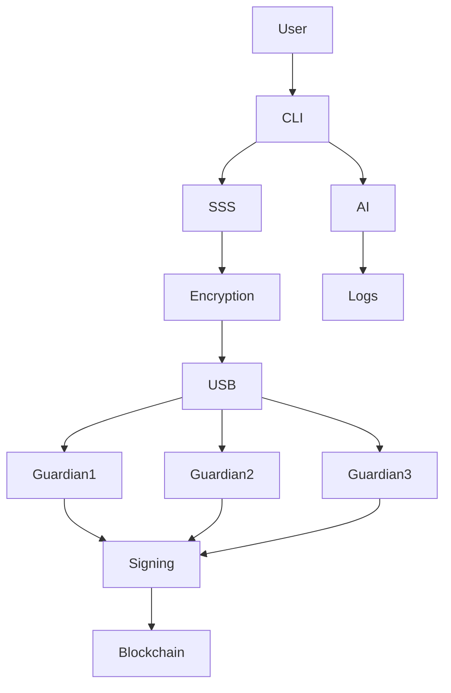

---

The architecture separates

- cryptographic processing
- storage
- authentication
- blockchain communication

into independent modules.

This minimizes coupling while simplifying auditing.

---

# 5. Core Components

The system consists of the following logical components.

```
HORCRUX

├── CLI
├── Configuration
├── Authentication
├── Secret Sharing
├── Encryption
├── USB Storage
├── Signing Engine
├── MPC Coordinator
├── Blockchain Interface
├── Logging
└── AI Detection
```

Each module owns exactly one responsibility.

---

# CLI Layer

Responsibilities

- parse commands
- collect user input
- initialize modules
- display output
- coordinate workflow

The CLI contains **no cryptographic logic**.

---

# Configuration Layer

Stores

- threshold
- guardian count
- curve
- signing mode
- logging options

Configuration is independent of shard storage.

---

# Secret Sharing Layer

Responsible for

```
Private Key

↓

Polynomial Generation

↓

Share Creation

↓

Share Reconstruction
```

Implements

- Shamir Secret Sharing

using configurable threshold values.

---

# Authentication Layer

Responsible for

```
Password

↓

Argon2id

↓

AES Key
```

No passwords are stored.

Only derived keys exist temporarily.

---

# Encryption Layer

Receives

```
Raw Share
```

Produces

```
Encrypted Share

+

Nonce

+

Salt

+

Authentication Tag
```

Uses

AES-256-GCM

---

# Storage Layer

Responsible for

```
Binary Serialization

↓

USB Writing

↓

USB Reading

↓

Integrity Verification
```

Storage never accesses plaintext keys.

---

# Signing Layer

Produces

```
Transaction

↓

ECDSA Signature

↓

Signed Transaction
```

Uses

- secp256k1
- alloy
- k256

---

# MPC Layer

Coordinates

```
Guardian Nodes

↓

Partial Signatures

↓

Aggregation

↓

ECDSA Signature
```

The coordinator never owns the private key.

---

# Blockchain Layer

Responsible only for

```
Broadcast

↓

Transaction Hash

↓

Confirmation
```

No wallet secrets enter this layer.

---

# AI Layer

Monitors

```
Access Logs

↓

Feature Extraction

↓

Isolation Forest

↓

Anomaly Score
```

Alerts are generated before signing.

---

# Logging Layer

Records

- timestamp
- guardian id
- USB id
- result
- anomaly score

Logs never contain

- passwords
- private keys
- decrypted shares

---

# 6. Operational Phases

HORCRUX executes three distinct ceremonies.

```
Setup

↓

Distribution

↓

Access
```

Each ceremony has independent security guarantees.

---

# Phase 1 — Setup Ceremony

Purpose

Create encrypted shards.

Workflow

```mermaid
flowchart LR

Key

-->

Split

-->

Encrypt

-->

USB

-->

Destroy Key
```

Steps

1. User enters private key.

2. Threshold parameters selected.

3. Polynomial generated.

4. Shares produced.

5. Password derived.

6. AES encryption performed.

7. USB files written.

8. Original key zeroized.

---

# Phase 2 — Distribution Ceremony

Purpose

Distribute trust.

```
Guardian A

← USB 1

Guardian B

← USB 2

Guardian C

← USB 3
```

Rules

- One guardian receives one shard.

- Passwords remain private.

- USBs are never copied digitally.

---

# Phase 3 — Access Ceremony

Two execution modes exist.

```
Sign

↓

Mode A

OR

Mode B
```

Selection depends on

- threat model
- network availability
- operational requirements

---
---

# 7. Detailed Data Flow

The complete lifecycle of a blockchain private key inside HORCRUX is illustrated below.

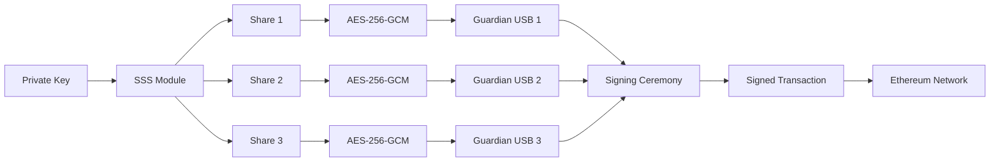

At no point are plaintext shards written to persistent storage.

---

# Data Ownership

| Stage | Owner | Secret Exists? |
|--------|-------|----------------|
| User Input | Owner | Yes |
| SSS Split | CLI Memory | Yes |
| After Encryption | USB | No (encrypted) |
| Guardian Storage | Guardian | No |
| Mode A Signing | Locked RAM | Temporarily |
| Mode B Signing | Never reconstructed | No |

---

# 8. Module Architecture

Each subsystem has a single responsibility.

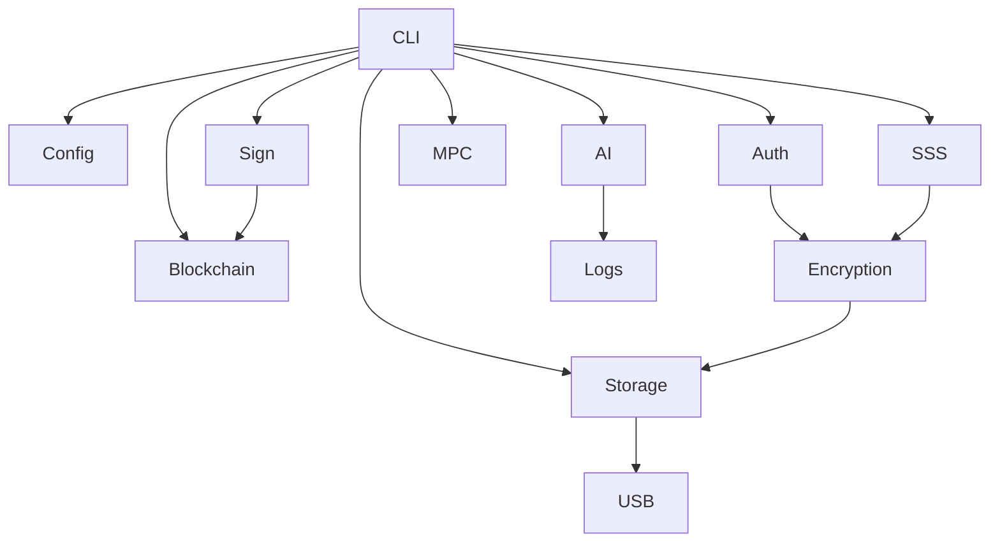

---

## CLI Module

Responsibilities

- Parse CLI arguments
- Interactive prompts
- Password collection
- Workflow orchestration
- Error reporting

The CLI intentionally contains **no cryptographic implementation**.

---

## Secret Sharing Module

Responsibilities

- Generate random polynomial
- Split secret
- Serialize shares
- Reconstruct secret
- Validate threshold

Input

```
32-byte Private Key
```

Output

```
Share 1
Share 2
...
Share N
```

---

## Encryption Module

Responsibilities

- Generate salt
- Generate nonce
- Derive AES key
- Encrypt shard
- Authenticate ciphertext

```text
Password
      │
      ▼
 Argon2id
      │
      ▼
 AES Key
      │
      ▼
AES-256-GCM
      │
      ▼
Encrypted Shard
```

---

## Authentication Module

Responsibilities

- Password validation
- Key derivation
- Access logging
- Failed attempt recording

The authentication layer never stores plaintext passwords.

---

## Storage Module

Responsibilities

- Serialize shard files
- Read shard files
- Verify integrity
- USB device abstraction

Expected file format

```
+---------------------+
| Metadata            |
+---------------------+
| Salt                |
+---------------------+
| Nonce               |
+---------------------+
| Ciphertext          |
+---------------------+
| Authentication Tag  |
+---------------------+
```

---

## Blockchain Module

Responsibilities

- Transaction construction
- Transaction signing
- RPC communication
- Broadcast
- Receipt verification

This module never receives guardian passwords.

---

## AI Module

Responsibilities

- Parse access logs
- Generate features
- Run anomaly detector
- Produce anomaly score

Example features

- Hour of access
- Failed attempts
- Guardian combination
- Device identifiers
- Time since previous signing

---

# 9. Mode A Architecture

Mode A is designed for environments where complete network isolation is required.

Examples

- Cold storage
- Institutional vaults
- Air-gapped computers
- Long-term custody

---

## Workflow

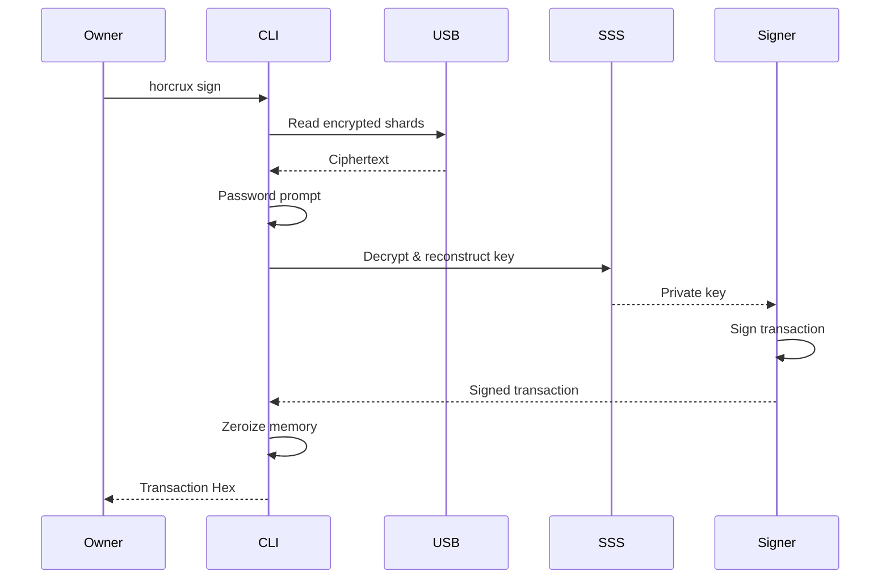

---

## Internal Pipeline

```
USB

↓

Read Shards

↓

Password Entry

↓

Argon2id

↓

AES Decryption

↓

Lagrange Reconstruction

↓

Private Key

↓

ECDSA Sign

↓

Zeroize

↓

Broadcast
```

---

## Security Characteristics

Advantages

- Completely offline

- No network dependency

- Simple operational model

- Easy disaster recovery

Trade-offs

- Private key exists briefly in RAM

- Requires trusted coordinator machine

---

# Mode A Memory Lifecycle

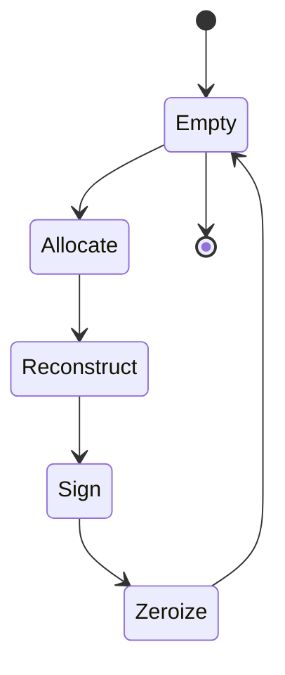

The reconstructed private key exists only between **Reconstruct** and **Zeroize**.

---

# 10. Mode B Architecture

Mode B eliminates private key reconstruction entirely.

Instead of reconstructing the secret, guardian nodes cooperatively generate a valid ECDSA signature.

---

## High-Level Architecture

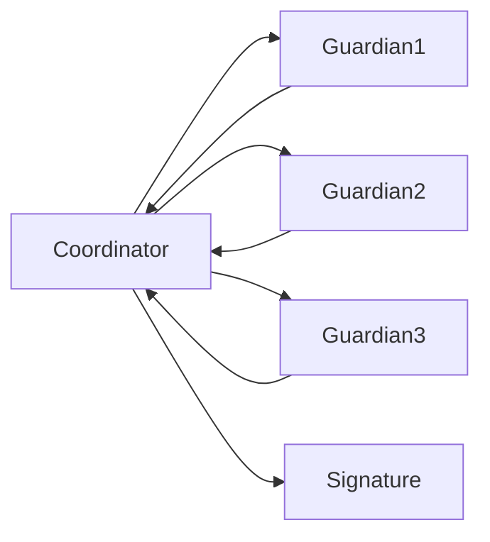

---

## Guardian Node

Each guardian node performs

```
Read USB

↓

Password

↓

Decrypt Local Share

↓

Participate in MPC

↓

Destroy Local State
```

No guardian receives another guardian's shard.

---

## Coordinator

Responsibilities

- Session creation
- Message routing
- Signature aggregation
- Failure detection

The coordinator is **not** trusted with private key material.

---

## Signing Pipeline

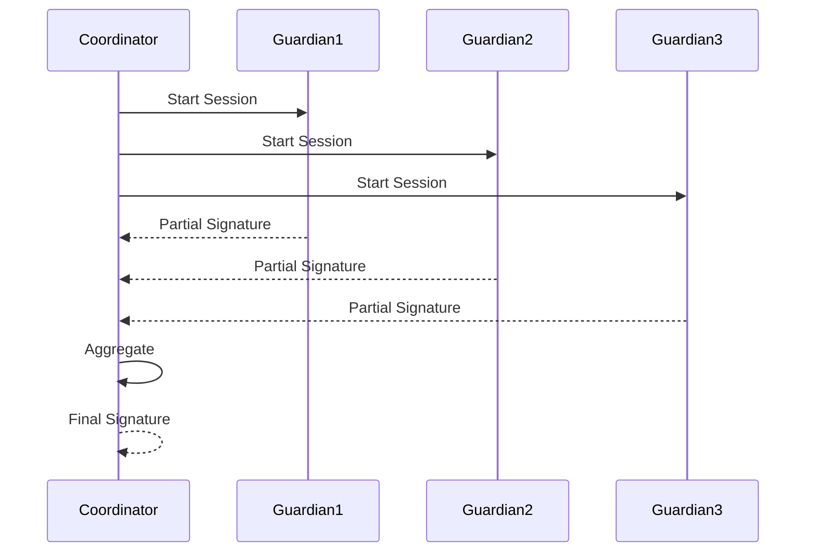

---

## Advantages

- Private key never reconstructed

- No single point of compromise

- Standard ECDSA output

- Compatible with Ethereum

---

## Limitations

- Requires multiple machines

- Network communication required

- Higher implementation complexity

- Longer signing ceremony

---
---

# 11. Trust Boundaries

HORCRUX intentionally separates trust across multiple independent domains.

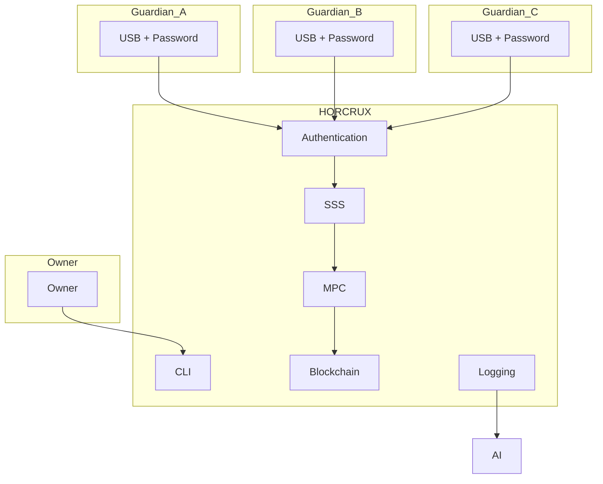

Each boundary protects against a different class of attack.

| Boundary | Protection |
|-----------|------------|
| User ↔ CLI | Hidden input, validation |
| CLI ↔ Authentication | Password isolation |
| Authentication ↔ Encryption | Derived keys only |
| Encryption ↔ Storage | Ciphertext only |
| Storage ↔ USB | Physical isolation |
| Signing ↔ Blockchain | Signed transactions only |

---

# 12. Security Architecture

HORCRUX follows a **defense-in-depth** model where multiple independent security mechanisms work together.

```text
                User

                 │

                 ▼

        Guardian Password

                 │

                 ▼

             Argon2id

                 │

                 ▼

           AES-256-GCM

                 │

                 ▼

       Shamir Secret Sharing

                 │

                 ▼

          Threshold Policy

                 │

                 ▼

          Memory Zeroization

                 │

                 ▼

         Behavioral Detection
```

No single layer is trusted on its own.

---

## Cryptographic Layers

### Layer 1 – Password Hardening

Passwords are transformed into encryption keys using Argon2id.

Purpose

- Slow brute-force attacks
- Increase attacker cost
- Memory hardness

---

### Layer 2 – Authenticated Encryption

Each shard is encrypted using AES-256-GCM.

Provides

- Confidentiality
- Integrity
- Authentication

Any modification invalidates the authentication tag.

---

### Layer 3 – Secret Sharing

Shamir Secret Sharing distributes trust mathematically.

Properties

- Configurable threshold
- Information-theoretic secrecy
- No information leakage below threshold

---

### Layer 4 – Threshold Signing

Mode B eliminates reconstruction completely.

The resulting ECDSA signature is identical to one produced by a conventional wallet.

---

### Layer 5 – Memory Protection

Sensitive data exists only for the minimum required duration.

Objects protected

- Passwords
- AES keys
- Plaintext shares
- Reconstructed key
- MPC intermediate values

---

# 13. Memory Lifecycle

One of HORCRUX's primary design goals is minimizing the lifetime of sensitive material.

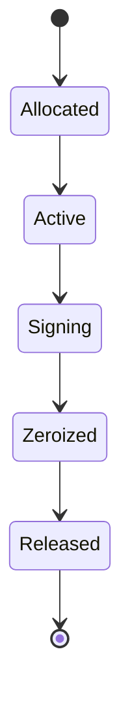

Sensitive memory is explicitly overwritten before being released back to the operating system.

---

## Zeroization Policy

The following objects are securely erased after use.

| Object | When Destroyed |
|----------|----------------|
| Guardian Password | Immediately after key derivation |
| AES Key | After shard decryption |
| Plaintext Share | After reconstruction |
| Private Key | Immediately after signing |
| MPC Buffers | After protocol completion |

---

# 14. USB Shard Format

Each guardian USB stores exactly one encrypted shard.

```
guardian-1.hrx
```

Internal structure

```text
+-----------------------------------+
| File Header                       |
+-----------------------------------+
| Version                           |
+-----------------------------------+
| Guardian Identifier               |
+-----------------------------------+
| Threshold Parameters              |
+-----------------------------------+
| Salt (Argon2id)                   |
+-----------------------------------+
| Nonce                             |
+-----------------------------------+
| AES-GCM Ciphertext                |
+-----------------------------------+
| Authentication Tag                |
+-----------------------------------+
| Optional Metadata                 |
+-----------------------------------+
```

The shard file never stores

- plaintext private key
- decrypted share
- guardian password

---

# 15. Deployment Architecture

## Mode A

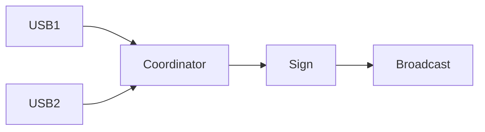

Only one machine is required.

---

## Mode B

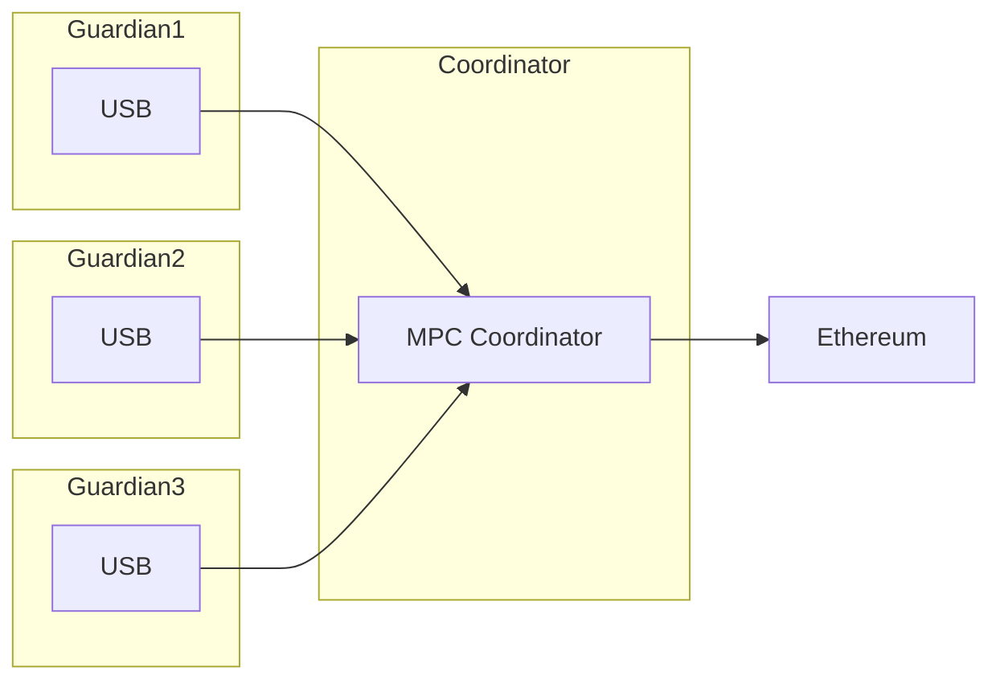

Every guardian operates independently.

---

# 16. Class Overview

The implementation is logically organized into the following classes and modules.

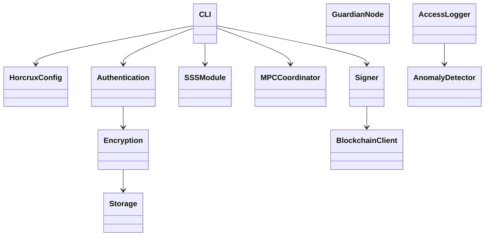

---

## Responsibility Matrix

| Module | Responsibility |
|---------|----------------|
| CLI | User interaction |
| Config | Runtime configuration |
| Authentication | Password handling |
| Encryption | AES-256-GCM |
| SSS | Split & reconstruct |
| Storage | USB persistence |
| Signer | ECDSA signing |
| MPC Coordinator | Distributed signing |
| Blockchain | Broadcast |
| Logger | Access history |
| AI | Behavioral analysis |

---

# 17. Failure Scenarios

The architecture is designed to fail securely.

## Scenario 1 – Lost USB

Result

No compromise.

Threshold recovery remains possible.

---

## Scenario 2 – Incorrect Password

Result

AES authentication fails.

No shard is revealed.

---

## Scenario 3 – Corrupted USB

Result

Integrity verification fails.

Signing is aborted.

---

## Scenario 4 – Insufficient Guardians

Result

Threshold policy prevents reconstruction.

No private key material is produced.

---

## Scenario 5 – Suspicious Behavior

Result

The anomaly detection module raises an alert before the signing process proceeds.

---

## Scenario 6 – Coordinator Failure (Mode B)

Result

The signing session is aborted.

Private key material remains protected because no complete key exists on any participant.

---

# 18. Future Extensibility

The architecture is intentionally modular to support future enhancements without redesigning the system.

Potential extensions include:

- Desktop GUI using Tauri
- Mobile companion application
- QR-based air-gapped MPC communication
- Multi-chain support (Bitcoin, Solana, Cosmos)
- Proactive secret sharing
- Hardware Security Module integration
- FIDO2 / WebAuthn authentication
- Secure enclave integration
- Hardware-backed USB authentication
- Third-party cryptographic audits

---

# Design Principles

HORCRUX is guided by the following engineering principles:

- Never implement cryptographic primitives from scratch.
- Prefer audited and well-established libraries.
- Separate cryptographic responsibilities into independent modules.
- Keep sensitive material in memory only for the minimum required duration.
- Design for offline-first operation.
- Preserve user sovereignty through self-custody.
- Ensure modularity for future protocol upgrades.

---

# Conclusion

HORCRUX combines threshold cryptography, authenticated encryption, secure memory management, and behavioral monitoring into a unified offline key management platform.

Its architecture separates responsibilities across cryptographic, storage, authentication, networking, and monitoring layers while maintaining compatibility with Ethereum-compatible ecosystems. By supporting both air-gapped secret reconstruction (Mode A) and true threshold ECDSA signing (Mode B), HORCRUX provides flexibility for different operational and security requirements without compromising the principles of self-custody and defense in depth.