# HORCRUX System Architecture

> Technical Architecture Documentation

Version: 2.0

This document describes the system **as built** (Phases 0–4 of the build plan),
not the original design sketch. Where the report originally targeted Ethereum
(ECDSA, `alloy`) and an Isolation-Forest anomaly detector, the implementation
signs **Solana** transactions with **Ed25519**, performs **Mode B** threshold
signing with **FROST** (`frost-ed25519`), and uses a **rule-based anomaly
scorer**. Everything below reflects the shipped code.

---

# Table of Contents

1. Introduction
2. Architectural Goals
3. System Overview
4. High-Level Architecture
5. System Components
6. Operational Phases
7. Data Flow
8. Module Architecture
9. Mode A Architecture
10. Mode B Architecture
11. Security Architecture
12. Trust Boundaries
13. Memory Lifecycle
14. Storage Architecture
15. Network Architecture
16. Class Overview
17. Sequence Diagrams
18. Failure Scenarios
19. Future Architecture

---

# 1. Introduction

HORCRUX is designed around one fundamental principle:

> **A blockchain private key should never become a single point of failure.**

Unlike conventional wallets that store one encrypted private key inside one device,
HORCRUX distributes trust across multiple independent guardians using threshold
cryptography.

The architecture combines three independent security domains:

- Cryptography
- Physical custody
- Behavioral security

The result is an end-to-end offline key management lifecycle.

---

# 2. Architectural Goals

The system is designed to satisfy the following properties.

## Confidentiality

Private keys must never be exposed unless the threshold policy is satisfied.

## Integrity

Shard modification must always be detected (AES-256-GCM authentication tags).

## Availability

Loss of one guardian must not destroy the wallet (t-of-n redundancy).

## Offline Operation

Signing (both modes) is fully offline; only the optional broadcast step touches
the network.

## Self Custody

No cloud providers, no centralized servers, no third-party custody.

## Extensibility

Each cryptographic module is replaceable without affecting the remaining system.

---

# 3. System Overview

The architecture consists of three operational phases.

```
           Setup
             │
             ▼
      Key Splitting
             │
             ▼
    Shard Encryption
             │
             ▼
    USB Distribution
             │
─────────────┼─────────────
             │
             ▼
      Signing Ceremony
      ┌───────────────┐
      │               │
      ▼               ▼
    Mode A         Mode B
   (reconstruct)   (FROST)
```

Each phase performs one clearly defined responsibility.

---

# 4. High-Level Architecture

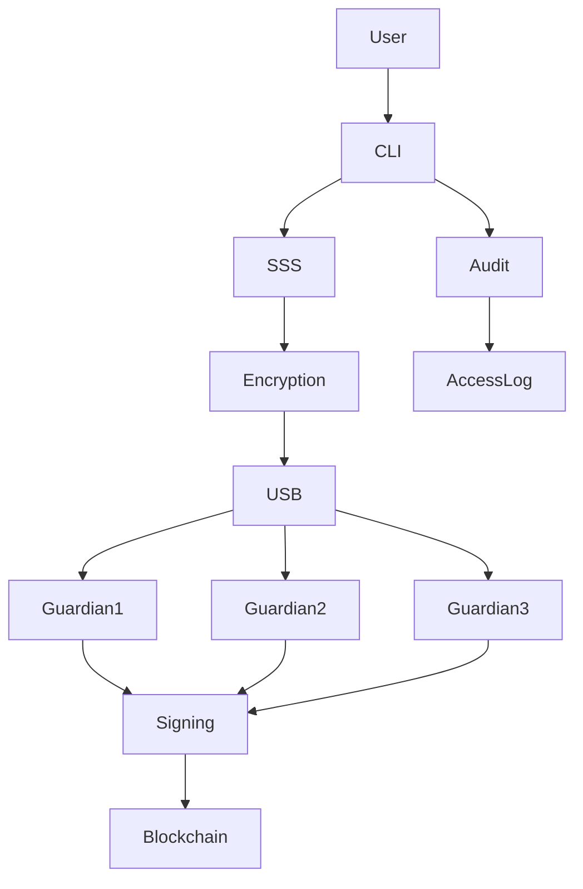

The architecture separates cryptographic processing, storage, authentication,
and blockchain communication into independent modules.

---

# 5. Core Components

The system consists of the following logical components.

```
HORCRUX

├── CLI                 (src/main.rs)
├── Secret Sharing      (src/sss.rs, via vsss-rs)
├── Encryption          (src/crypto.rs, Argon2id + AES-256-GCM)
├── Shard Storage       (src/shard.rs, HX1)
├── Mode A Signing      (src/tx.rs, ed25519-dalek)
├── FROST MPC           (src/mpc.rs, frost-ed25519)
├── Blockchain Access   (src/chain.rs, solana-rpc-client)
├── Access Log / Audit  (src/audit.rs)
├── Verification        (src/verify.rs)
└── Error Types         (src/error.rs)
```

Each module owns exactly one responsibility.

---

# CLI Layer

Responsibilities

- parse commands
- collect user input
- initialize modules
- display output
- coordinate workflow

The CLI contains **no cryptographic logic**.

Commands:

```
horcrux
├── init          split + encrypt a key into HX1 shards
├── reconstruct   recover the key from a threshold subset
├── sign          Mode A: reconstruct + sign a Solana transfer
├── mpc-split     dealer-split a key into HX2 FROST key shares
├── mpc-sign      Mode B: threshold-sign from HX2 shares
├── verify        passive structural + auth-tag integrity check
├── log           view the access log
└── help
```

---

# Secret Sharing Layer

Responsible for

```
Private Key
    ↓
Polynomial Generation (over the secp256k1 field)
    ↓
Share Creation
    ↓
Share Reconstruction (Lagrange interpolation)
```

Implements Shamir Secret Sharing (`vsss-rs`) with configurable threshold values.

**Field note:** the Shamir field stays `k256`/secp256k1 even though signing is
Ed25519. The field is a math-only choice; any 32 bytes is a valid Ed25519 seed,
and `vsss-rs` interpolates over any prime field.

---

# Authentication Layer

Responsible for

```
Password
    ↓
Argon2id (19 MiB, 2 passes, 1 lane)
    ↓
AES-256 key
```

No passwords are stored. Only derived keys exist temporarily.

---

# Encryption Layer

Receives

```
Raw Share
```

Produces

```
Encrypted Share + Nonce + Salt + Authentication Tag
```

Uses AES-256-GCM, binding each share's threshold/share-count/id into the
authenticated data (AAD), so a shard from another split cannot decrypt.

---

# Storage Layer

Responsible for

```
Binary Serialization
    ↓
File Writing
    ↓
File Reading
    ↓
Integrity Verification
```

Storage never accesses plaintext keys. Two on-disk formats exist (see
§14): `HX1` for SSS shards and `HX2` for FROST key shares.

---

# Signing Layer (Mode A)

Produces

```
Transaction (system_program transfer)
    ↓
Ed25519 Signature (ed25519-dalek)
    ↓
Signed Transaction
```

The bytes signed are `message.serialize()` — the bincode serialization of the
Solana legacy message — which is exactly what the cluster receives via
`sendTransaction`. The signing key is wiped on drop (`zeroize`).

---

# MPC Layer (Mode B)

Runs the two-round FROST protocol over Ed25519 (`frost-ed25519`, RFC 9591):

```
Share Files (HX2)
    ↓
Decrypt Each Key Share
    ↓
Round 1: Nonce Commitments
    ↓
Round 2: Signature Shares
    ↓
Aggregation
    ↓
Standard Ed25519 Signature
```

Each share file is an independent in-process participant. The coordinator
(aggregator) never owns the signing key, and the full key is never
reconstructed anywhere.

---

# Blockchain Layer

Responsible only for

```
Broadcast
    ↓
Transaction Hash
    ↓
Confirmation
```

Only signed transactions and public addresses enter this layer; no wallet
secrets do. RPC access goes through `solana-rpc-client` (3.x split crates).

---

# Audit Layer

Records every shard decryption attempt to an **append-only** JSON-lines access
log, then scores each new attempt before any key material is handled.

Signals evaluated by the rule-based scorer (`src/audit.rs`):

| Signal | Effect |
|--------|--------|
| 3+ trailing decrypt failures within the last hour | **Block** |
| Attempt during UTC 00:00–06:00 | Warn |
| Shard combination never used before | Warn |
| Inter-attempt gap z-score > 3 | Warn |

Blocked attempts are themselves logged, so a refused attempt cannot hide.
`--force` overrides a block.

---

# 6. Operational Phases

HORCRUX executes three ceremonies.

```
Setup
    ↓
Distribution
    ↓
Access
```

Each ceremony has independent security guarantees.

---

# Phase 1 — Setup Ceremony

Purpose: create encrypted shards.

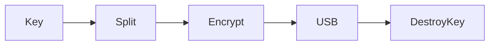

Steps

1. User enters a private key (`--key-hex`) or generates a disposable one
   (`--generate`).
2. Threshold parameters are selected (`--threshold`/`--shares`).
3. A random polynomial is generated over the secp256k1 field.
4. Shares are produced.
5. A password per shard derives an AES key (Argon2id).
6. AES-256-GCM encryption is performed.
7. HX1 shard files are written.
8. The original key is zeroized.

---

# Phase 2 — Distribution Ceremony

Purpose: distribute trust.

```
Guardian A ← USB 1
Guardian B ← USB 2
Guardian C ← USB 3
```

Rules

- One guardian receives one shard.
- Passwords remain private.
- USBs are never copied digitally.

---

# Phase 3 — Access Ceremony

Two execution modes exist.

```
Sign
    ↓
Mode A   OR   Mode B
```

Selection depends on threat model, network availability, and operational
requirements. Before either mode runs, the audit layer scores the attempt and
may block it.

---

# 7. Detailed Data Flow

The complete lifecycle of a signing seed inside HORCRUX is illustrated below.

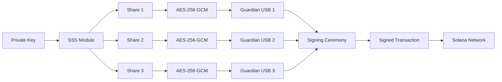

At no point are plaintext shards written to persistent storage.

---

# Data Ownership

| Stage | Owner | Secret Exists? |
|--------|-------|----------------|
| User Input | Owner | Yes |
| SSS Split | CLI Memory | Yes |
| After Encryption | USB | No (encrypted) |
| Guardian Storage | Guardian | No |
| Mode A Signing | Locked RAM | Temporarily |
| Mode B Signing | Never reconstructed | No |

---

# 8. Module Architecture

Each subsystem has a single responsibility.

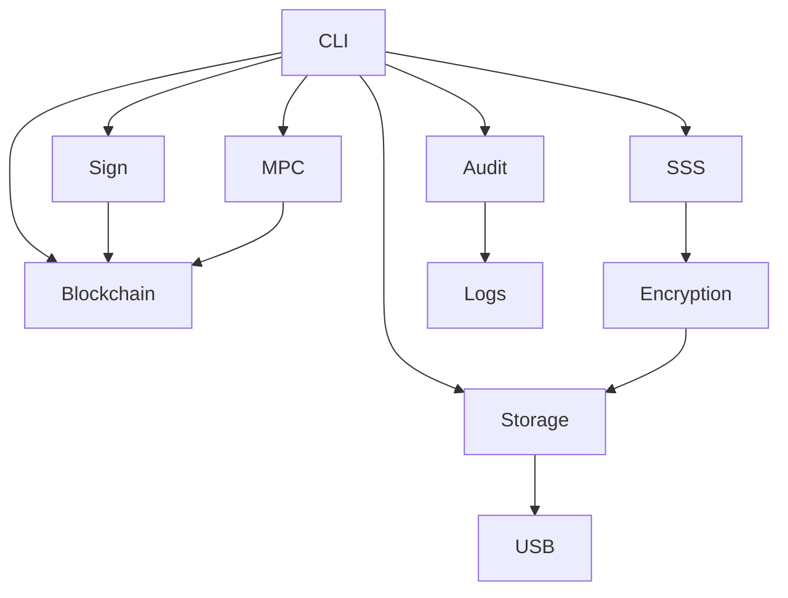

---

## Secret Sharing Module

Responsibilities

- Generate random polynomial
- Split secret
- Reconstruct secret
- Validate threshold

Input: 32-byte private key. Output: N shares.

---

## Encryption Module

Responsibilities

- Generate salt
- Generate nonce
- Derive AES key (Argon2id)
- Encrypt shard
- Authenticate ciphertext

---

## Authentication Module

Responsibilities

- Password validation
- Key derivation
- Access logging
- Failed attempt recording

The authentication layer never stores plaintext passwords.

---

## Storage Module

Responsibilities

- Serialize shard files
- Read shard files
- Verify integrity (structure + GCM tag)

---

## Blockchain Module

Responsibilities

- Transaction construction
- Transaction signing
- RPC communication (fetch blockhash, check balance)
- Broadcast
- Confirmation

This module never receives guardian passwords.

---

## Audit Module

Responsibilities

- Parse access logs
- Generate features (hour, failures, combination, gaps)
- Run the rule-based scorer
- Produce an allow/warn/block verdict

---

# 9. Mode A Architecture

Mode A is designed for environments where complete network isolation is
required.

Examples

- Cold storage
- Institutional vaults
- Air-gapped computers
- Long-term custody

## Workflow

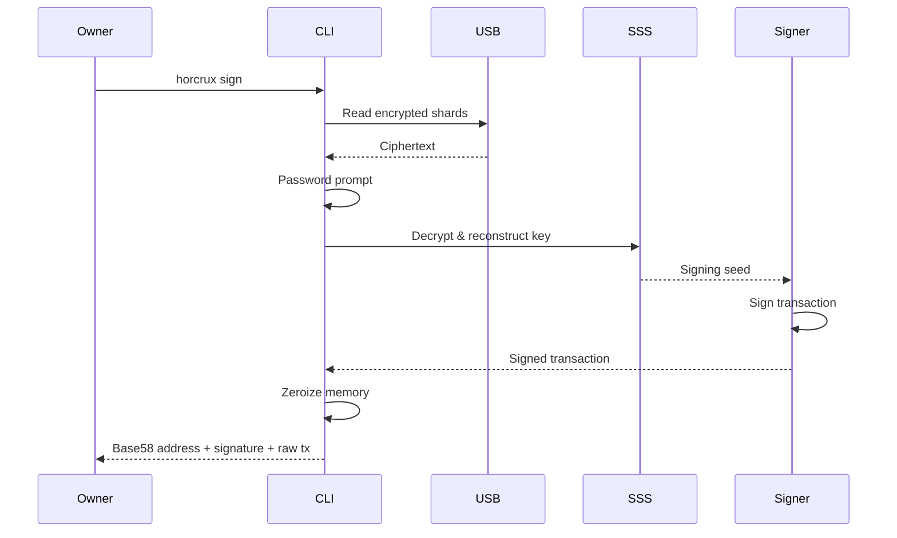

## Internal Pipeline

```
USB
    ↓
Read Shards
    ↓
Password Entry
    ↓
Argon2id
    ↓
AES Decryption
    ↓
Lagrange Reconstruction
    ↓
Signing Seed
    ↓
Ed25519 Sign
    ↓
Zeroize
    ↓
Broadcast (opt-in)
```

## Security Characteristics

Advantages

- Completely offline
- No network dependency
- Simple operational model
- Easy disaster recovery

Trade-offs

- Signing seed exists briefly in RAM
- Requires a trusted coordinator machine

---

# Mode A Memory Lifecycle

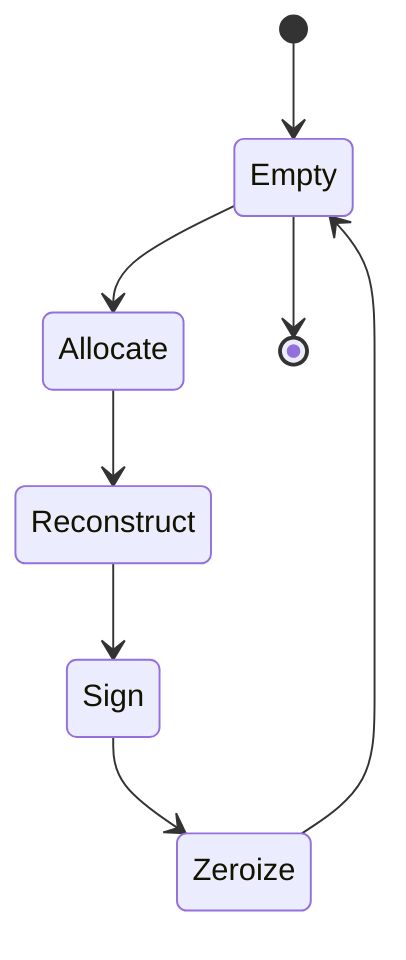

The reconstructed signing seed exists only between **Reconstruct** and
**Zeroize**.

---

# 10. Mode B Architecture

Mode B eliminates key reconstruction entirely. Instead of assembling the
secret, share files cooperatively generate a valid Ed25519 signature via the
two-round FROST protocol. The implementation uses the **trusted-dealer**
variant: `horcrux mpc-split` dealer-splits the seed into key shares with
`frost-ed25519`, and each share file acts as one in-process participant during
`horcrux mpc-sign`.

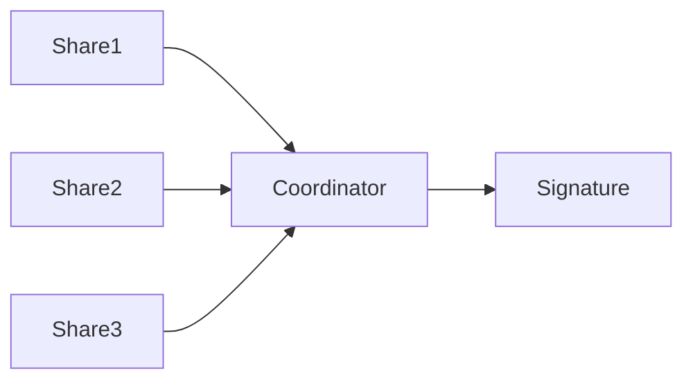

## Participant

Each share file contributes

```
Read USB
    ↓
Password
    ↓
Decrypt Local Key Share
    ↓
Round 1: Nonce Commitment
    ↓
Round 2: Signature Share
    ↓
Destroy Local State
```

No participant receives another participant's share.

## Coordinator

Responsibilities

- Decrypt each share into a participant
- Collect nonce commitments
- Collect signature shares
- Aggregate into a final signature

The coordinator never reconstructs or holds the full signing key.

## Signing Pipeline

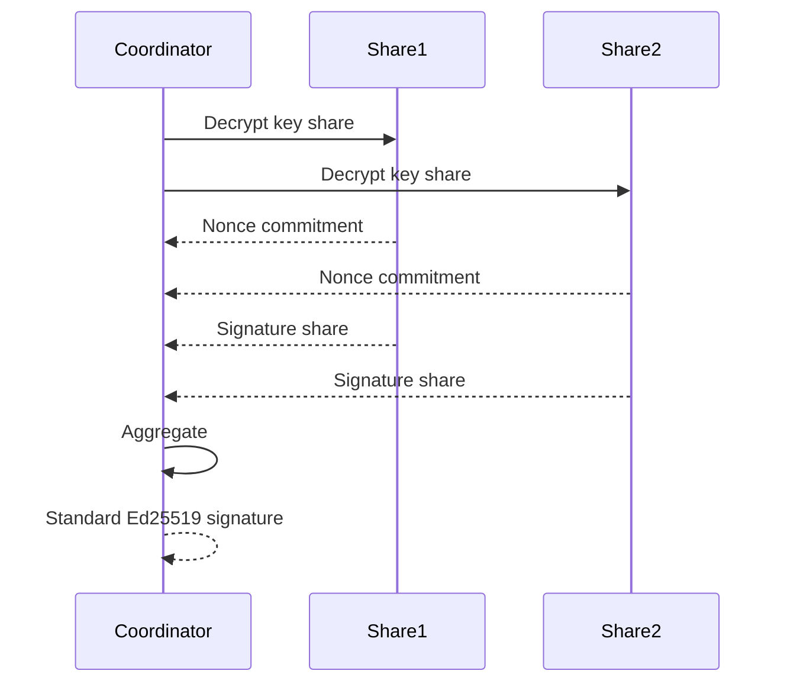

## Key Properties

- Because the FROST group is derived from the same 32-byte seed, the group
  address equals the Mode A wallet address.
- The aggregated signature is an ordinary RFC 8032 Ed25519 signature, so it
  flows through the Mode A Solana sign/broadcast path unchanged.
- Signatures are non-deterministic (fresh nonces per signing operation).
- The full signing key never exists on any machine.

## Advantages

- Private key never reconstructed
- No single point of compromise
- Standard Ed25519 output
- Compatible with Solana (and any Ed25519 verifier)

## Limitations

- Uses a trusted dealer at split time (dealer must destroy the key after
  splitting)
- Higher complexity than Mode A
- Requires collecting a threshold of guardian passwords/shares

> **DKG is explicitly out of scope** for this project (see build plan); the
> trusted-dealer fallback preserves the core claim that the key is never
> assembled for signing.

---

# 11. Security Architecture

HORCRUX follows a **defense-in-depth** model where multiple independent
mechanisms work together.

```text
                User
                 │
                 ▼
        Guardian Password
                 │
                 ▼
             Argon2id
                 │
                 ▼
           AES-256-GCM
                 │
                 ▼
        Shamir Secret Sharing
                 │
                 ▼
         Threshold Policy
                 │
                 ▼
          Memory Zeroization
                 │
                 ▼
         Behavioral Detection
```

No single layer is trusted on its own.

## Cryptographic Layers

### Layer 1 – Password Hardening

Passwords are transformed into encryption keys using Argon2id.

### Layer 2 – Authenticated Encryption

Each shard is encrypted using AES-256-GCM. Any modification invalidates the
authentication tag.

### Layer 3 – Secret Sharing

Shamir Secret Sharing distributes trust mathematically.

### Layer 4 – Threshold Signing

Mode B eliminates reconstruction entirely via FROST; the resulting Ed25519
signature is identical to one produced by a conventional wallet.

### Layer 5 – Memory Protection

Sensitive data exists only for the minimum required duration.

---

# 12. Trust Boundaries

HORCRUX intentionally separates trust across independent domains.

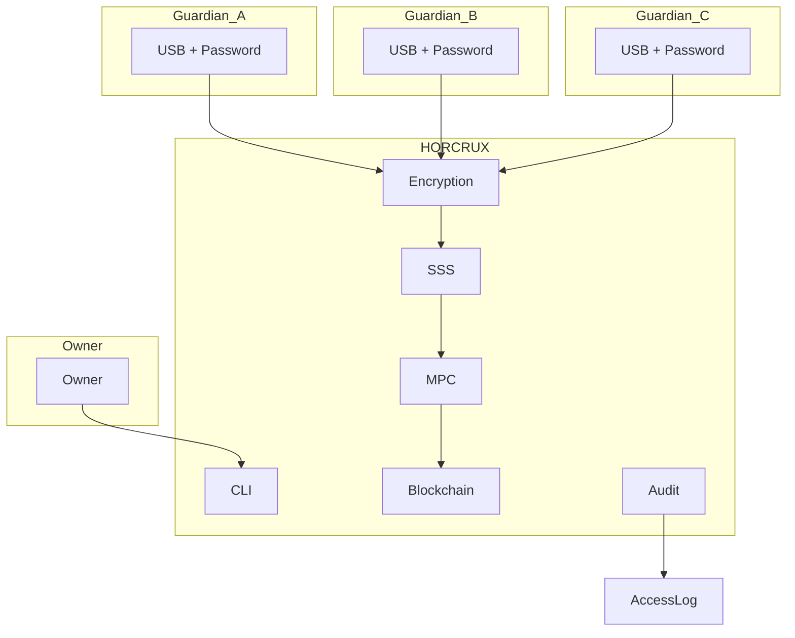

Each boundary protects against a different class of attack.

| Boundary | Protection |
|-----------|------------|
| User ↔ CLI | Hidden input, validation |
| CLI ↔ Encryption | Password isolation |
| Encryption ↔ Storage | Ciphertext only |
| Storage ↔ USB | Physical isolation |
| Signing ↔ Blockchain | Signed transactions only |

---

# 13. Memory Lifecycle

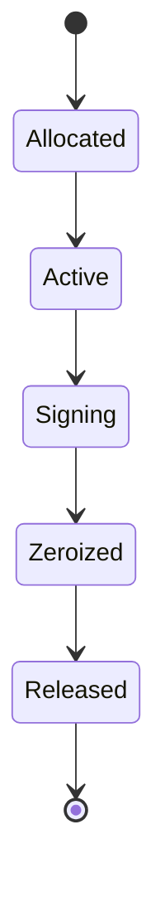

Sensitive memory is explicitly overwritten before being released back to the
operating system.

## Zeroization Policy

| Object | When Destroyed |
|----------|----------------|
| Guardian Password | Immediately after key derivation |
| AES Key | After shard decryption |
| Plaintext Share | After reconstruction |
| Signing Seed | Immediately after signing |
| FROST Buffers | After protocol completion |

`zeroize` covers the k256 scalar, ed25519-dalek signing keys, and the caller's
seed buffer.

---

# 14. USB Shard Format

Each guardian USB stores exactly one encrypted shard. Two formats exist,
distinguished by their magic bytes.

## HX1 — SSS shard (83 bytes)

```
+-----------------------------------+
| magic "HX1"          | 0..3      |
| format version = 1   | 3         |
| threshold t          | 4         |
| share count n        | 5         |
| share id             | 6         |
| Argon2id salt        | 7..23     |
| AES-GCM nonce        | 23..35    |
| sealed share value   | 35..67    |
| GCM auth tag         | 67..83    |
+-----------------------------------+
```

Written by `init`, consumed by `reconstruct`/`sign`.

## HX2 — FROST key share (variable)

```
+-----------------------------------+
| magic "HX2"          | 0..3      |
| format version = 1   | 3         |
| min signers (t)      | 4         |
| max signers (n)      | 5         |
| participant id       | 6         |
| Argon2id salt        | 7..23     |
| AES-GCM nonce        | 23..35    |
| sealed length (u16 LE)| 35..37    |
| sealed KeyPackage + tag            |
+-----------------------------------+
```

Written by `mpc-split` (alongside the non-secret `group.pub`), consumed by
`mpc-sign`. The sealed payload is the serialized FROST `KeyPackage` with the
AES-GCM tag appended.

The shard files never store the plaintext key, a decrypted share, or a
guardian password.

---

# 15. Deployment Architecture

## Mode A

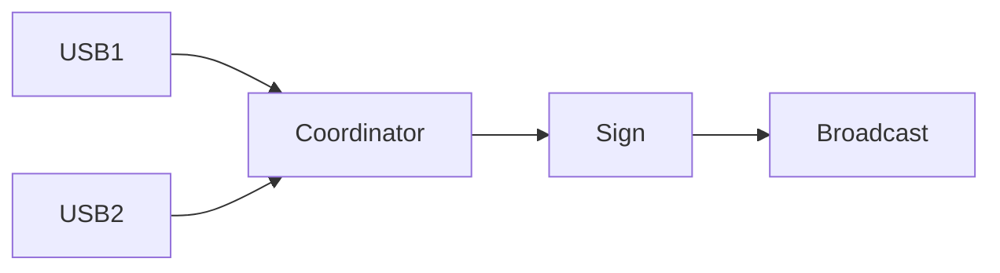

Only one machine is required.

## Mode B

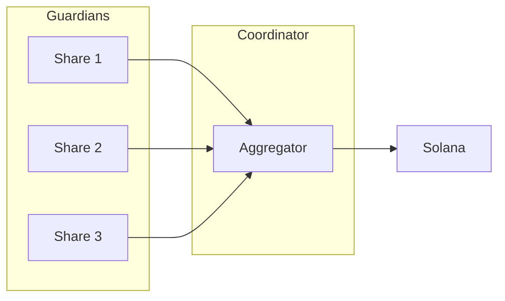

The shares may live on separate guardian machines; signing requires only that a
threshold of share files be made available to the coordinator.

---

# 16. Class Overview

The implementation is organized into the following modules.

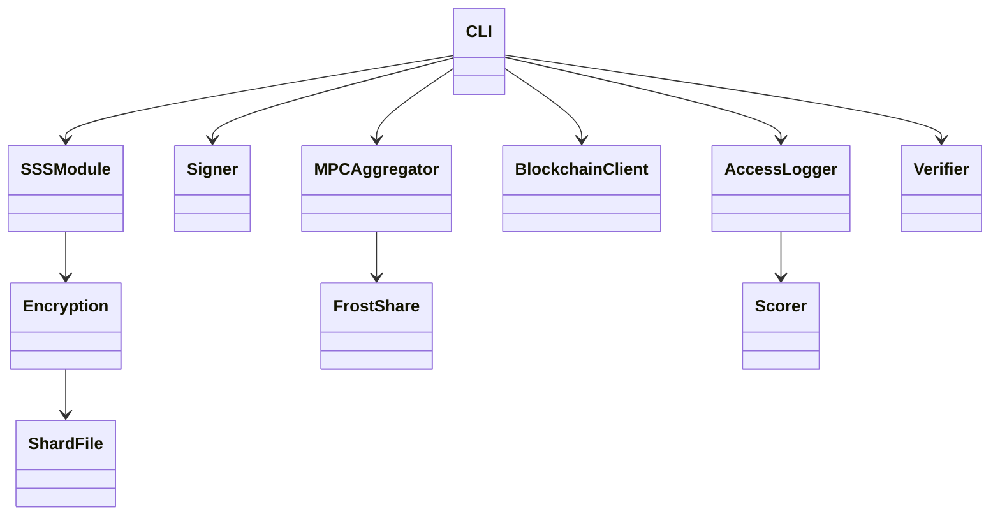

## Responsibility Matrix

| Module | Responsibility |
|---------|----------------|
| CLI | User interaction |
| Encryption | Argon2id + AES-256-GCM |
| SSS | Split & reconstruct |
| Storage | HX1/HX2 persistence |
| Signer | Ed25519 signing |
| MPC | FROST threshold signing |
| Blockchain | Broadcast |
| Logger | Access history |
| Scorer | Behavioral analysis |
| Verifier | Passive integrity checks |

---

# 17. Sequence Diagrams

## Mode A — Sign Offline

```mermaid
sequenceDiagram

participant Owner
participant CLI
participant Audit
participant Shards
participant Signer

Owner->>CLI: horcrux sign s1.hx s2.hx --to ... --lamports ... --blockhash ...
CLI->>Audit: assess attempt (shard ids, time, history)
Audit-->>CLI: allow / warn / block
alt Blocked and not --force
    CLI-->>Owner: refused; blocked entry logged
else
    CLI->>Shards: read + decrypt each shard
    Shards-->>Audit: decrypt_ok/decrypt_fail per shard
    CLI->>Signer: reconstruct seed, sign message
    Signer-->>CLI: signed tx
    CLI->>CLI: zeroize seed
    CLI-->>Owner: From / Signature / Raw base58
end
```

## Mode B — FROST Threshold Sign

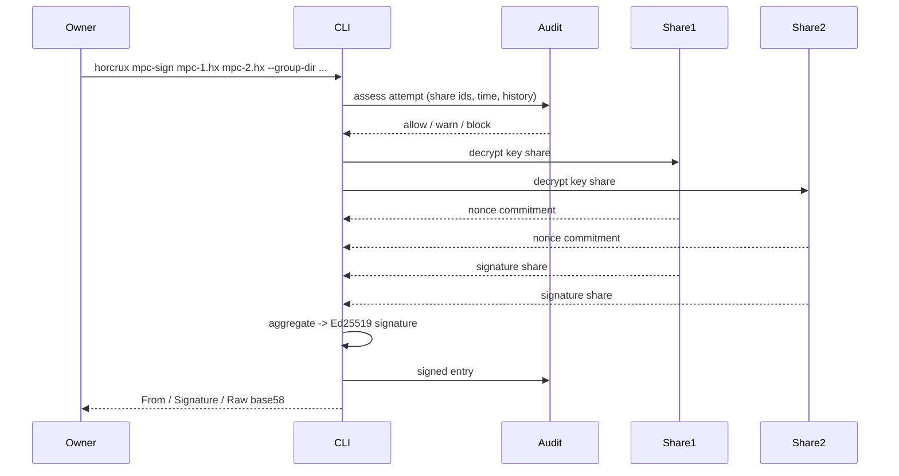

---

# 18. Failure Scenarios

The architecture is designed to fail securely.

## Scenario 1 – Lost USB

Result: No compromise. Threshold recovery remains possible.

## Scenario 2 – Incorrect Password

Result: AES-GCM authentication fails. No shard is revealed. Logged as a
`decrypt_fail`; repeated failures block future attempts.

## Scenario 3 – Corrupted USB

Result: Integrity verification fails (`horcrux verify` or the GCM tag check).
Signing is aborted.

## Scenario 4 – Insufficient Guardians

Result: Threshold policy prevents reconstruction/signing (`NotEnoughShares`).
No key material is produced.

## Scenario 5 – Suspicious Behavior

Result: The audit scorer raises a block/warning before signing proceeds.

## Scenario 6 – Share Type Confusion

Result: An SSS shard (`HX1`) is rejected as a FROST share (`HX2`) and vice
versa via magic-byte checks; shares from different FROST groups are rejected.

---

# 19. Future Extensibility

The architecture is intentionally modular to support future enhancements
without redesigning the system.

Potential extensions include:

- Desktop GUI using Tauri
- QR-based air-gapped MPC communication
- Multi-chain support (Bitcoin, Cosmos)
- Proactive secret sharing / periodic key refresh
- Distributed Key Generation (DKG) to remove the trusted dealer
- Hardware Security Module integration
- Third-party cryptographic audits

---

# Design Principles

- Never implement cryptographic primitives from scratch.
- Prefer audited and well-established libraries.
- Separate cryptographic responsibilities into independent modules.
- Keep sensitive material in memory only for the minimum required duration.
- Design for offline-first operation.
- Preserve user sovereignty through self-custody.
- Ensure modularity for future protocol upgrades.

---

# Conclusion

HORCRUX combines threshold cryptography, authenticated encryption, secure
memory management, and behavioral monitoring into a unified offline key
management platform for Solana. Its architecture separates responsibilities
across cryptographic, storage, authentication, networking, and monitoring
layers. By supporting both air-gapped secret reconstruction (Mode A) and true
threshold Ed25519 signing with FROST (Mode B), HORCRUX provides flexibility for
different operational and security requirements without compromising the
principles of self-custody and defense in depth.
